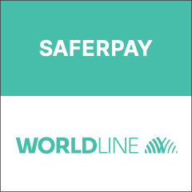
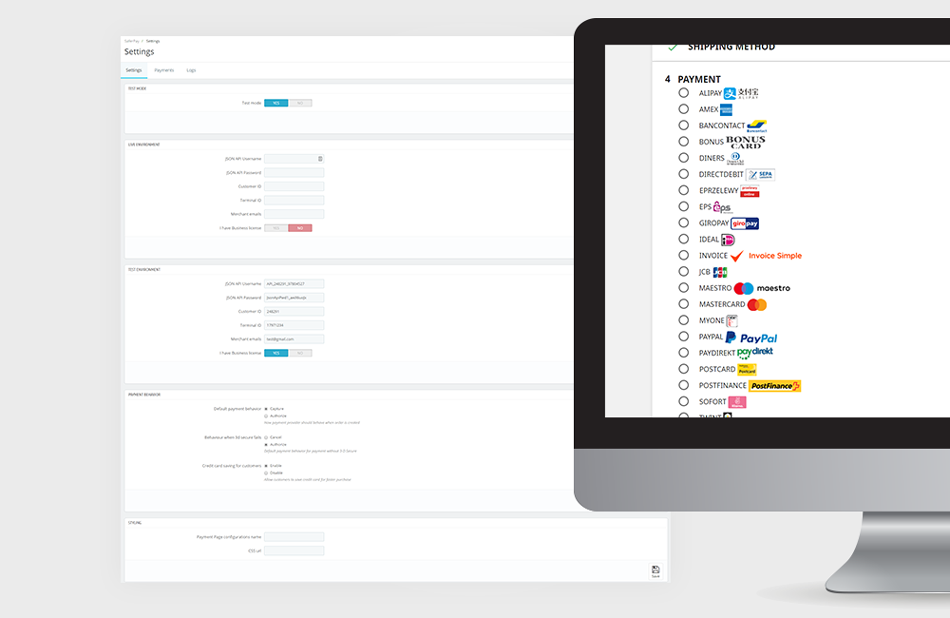

    

Saferpay - Easy, flexible, secure - The comprehensive e-payment solution from SIX Payment Services for easier and more secure payment in your online shop.

SIX Payment Services has been part of Worldline since the end of 2018, making it Europe's largest technology partner for banks and merchants. The tailor-made solutions from SIX Payment Services include a broad portfolio of payment terminals and the acceptance and processing of national and international payments with credit, debit and prepaid cards as well as the smartphone.

Worldline is European market leader in payment technology. More than 11,000 payment experts ensure future-oriented innovations and services in over 30 countries. With 45 years of experience, Worldline is an innovative pan-European company that covers the entire value chain of cashless payment transactions with its highly secure payment and transaction services.

Use of the Saferpay PrestaShop requires the following:

- A corresponding license for the Saferpay module.

- The existence of a valid identification with a username and password for the Saferpay Backoffice.
    - Respective API credentials for the Saferpay Live- and/or Test environment
    
- Availability of at least one active Saferpay terminal via which payment can be carried out and the associated
    
- Availability of Saferpay terminal number (Terminal ID parameter) and Saferpay customer number (CustomerId parameter).

- Availability of valid acceptance agreement for credit cards or other payment methods.

    

To register for live account please follow this link: https://www.six-payment-services.com/en/site/e-commerce/solutions/paymentsolution.html 

Test account information can be found here: https://www.six-payment-services.com/en/site/e-commerce-developer/testaccount.html

Please be sure to have composer installed on your device before installing the module, you can simply do that here - https://getcomposer.org/download/

<h1>Steps to use module from Github</h1>
You can download the module straight from GitHub:

1)    Find the section "Releases"
2)    Press on the latest release.
3)    Press on "saferpayofficial.zip" file and it will download automatically.
4)    Install the module to your shop.

Press here:

  
  

